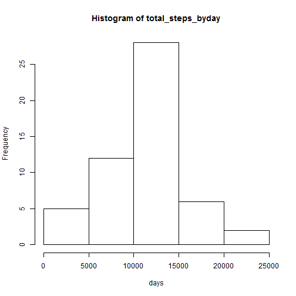
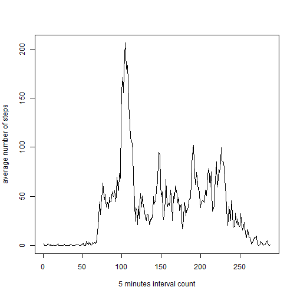
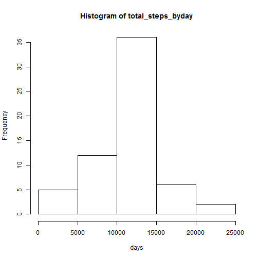
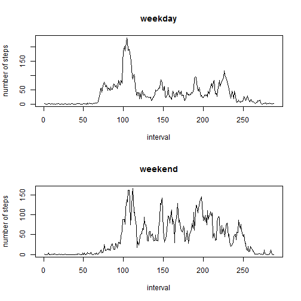

# Reproducible Research: Peer Assessment 1


## Loading and preprocessing the data
1.Load data from activity.csv file

Make sure the activity.csv is at same directory with this rmd file.

```r
data = read.csv("activity.csv")
```

2.Remove NA data , create a complete data set.

```r
complete_data = data[complete.cases(data), ]
complete_data$date = as.character(complete_data$date)
```


## What is mean total number of steps taken per day?
1.Make a histogram of the total number of steps taken each day

```r
total_steps_byday = tapply(complete_data$steps, complete_data$date, sum)
hist(total_steps_byday, xlab = "days")
```

 

2.Calculate the mean total number of steps taken per day

```r
mean(total_steps_byday)
```

```
## [1] 10766
```

3.Calculate median total number of steps taken per day

```r
median(total_steps_byday)
```

```
## [1] 10765
```


## What is the average daily activity pattern?
1.Make a time series plot (i.e. type = "l") of the 5-minute interval (x-axis) and the average number of steps taken, averaged across all days (y-axis)

```r
mean_steps_byinterval = tapply(complete_data$steps, complete_data$interval, 
    mean)
plot(mean_steps_byinterval, type = "l", xlab = "5 minutes interval count", ylab = "average number of steps")
```

 

2.Which 5-minute interval, on average across all the days in the dataset, contains the maximum number of steps?

```r
mean_steps_byinterval[mean_steps_byinterval == max(mean_steps_byinterval)]
```

```
##   835 
## 206.2
```


## Imputing missing values
1.Calculate and report the total number of missing values in the dataset (i.e. the total number of rows with NAs)

```r
dim(data)[1] - sum(complete.cases(data))
```

```
## [1] 2304
```

2.Devise a strategy for filling in all of the missing values in the dataset. The strategy does not need to be sophisticated. 

Find NA status of data set.

```r
summary(is.na(data$steps))
```

```
##    Mode   FALSE    TRUE    NA's 
## logical   15264    2304       0
```

```r
summary(is.na(data$date))
```

```
##    Mode   FALSE    NA's 
## logical   17568       0
```

```r
summary(is.na(data$interval))
```

```
##    Mode   FALSE    NA's 
## logical   17568       0
```

So I only need fill missing steps of original data set.I use average steps of interval to fill to missing steps with same interval.
3.Create a new dataset that is equal to the original dataset but with the missing data filled in.

```r
filling_data = data
for (i in 1:nrow(filling_data)) {
    if (is.na(filling_data$steps[i])) {
        filling_data$steps[i] = mean_steps_byinterval[as.character(filling_data$interval[i])]
    }
}
```

4.Make a histogram of the total number of steps taken each day and Calculate and report the mean and median total number of steps taken per day. 

```r
total_steps_byday = tapply(filling_data$steps, filling_data$date, sum)
hist(total_steps_byday, xlab = "days")
```

 

```r
mean(total_steps_byday)
```

```
## [1] 10766
```

```r
median(total_steps_byday)
```

```
## [1] 10766
```


## Are there differences in activity patterns between weekdays and weekends?
1.Create a new factor variable in the dataset with two levels ¨C ¡°weekday¡± and ¡°weekend¡± indicating whether a given date is a weekday or weekend day.

```r
days = as.POSIXct(strptime(filling_data$date, format = "%Y-%m-%d"))
days = as.POSIXlt(days)$wday
for (i in 1:length(days)) {
    if (days[i] == 0 | days[i] == 6) {
        days[i] = "weekend"
    } else {
        days[i] = "weekday"
    }
}
days = as.factor(days)
filling_data$weekday = days
```

2.Make a panel plot containing a time series plot (i.e. type = "l") of the 5-minute interval (x-axis) and the average number of steps taken, averaged across all weekday days or weekend days (y-axis).

```r
mean_steps_weekdays_byinterval = with(filling_data, tapply(steps, list(weekday, 
    interval), mean))
par(mfrow = c(2, 1))
plot(mean_steps_weekdays_byinterval[1, ], type = "l", xlab = "interval", ylab = "number of steps", 
    main = "weekday")
plot(mean_steps_weekdays_byinterval[2, ], type = "l", xlab = "interval", ylab = "number of steps", 
    main = "weekend")
```

 

